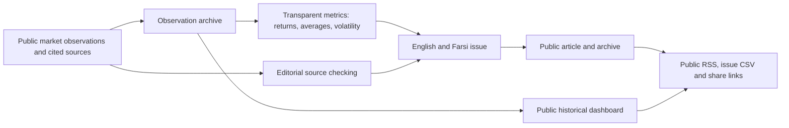

# World Energy Flow | Visual platform case study

**Project:** Public-facing bilingual energy-market analysis and research publishing. The source application and internal editorial workflows remain private. The original **World of Energy** weekly series is preserved as the historical publication identity; *World Energy Flow* is the wider platform.

## Publication and evidence workflow

**Evidence separation:** A sourced observation is not a calculated metric, an analytical inference, or a conditional scenario. This diagram summarizes the published editorial/data architecture; it does not claim an independently audited production-data pipeline.

## Show what visitors can inspect

- **Live platform:** [worldenergyflow.com](https://worldenergyflow.com) (public link supplied in the existing project README; live operation has not been retested in this PR).
- **Public technology:** the [README](../README.md) documents the site architecture, bilingual support, archive, dashboard, export and editorial standards.
- **Public case study:** [index.html](../index.html) describes the product without publishing the private source.

## Screenshot release gate

No screenshot of the live dashboard is included in this change. Before adding one, capture an actual public dashboard/article view, verify the publication date and numeric values against publicly released observations, and exclude unpublished editorial drafts, analytics and deployment bindings. Label a case-study page screenshot as a **case-study page**, not a screenshot of the private application.

## Suggested GitHub About fields (not automatically applied)

- **Description:** `Bilingual energy-market research platform connecting price data, systems thinking and source-linked analysis.`
- **Topics:** `energy-systems`, `energy-markets`, `systems-thinking`, `data-visualization`, `research-publishing`
- **Homepage:** `https://worldenergyflow.com` (verify public accessibility before applying).

No source code, credentials, unpublished analysis or private data are copied into this repository.