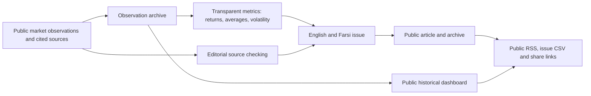

# World Energy Flow | Visual platform case study

**Project:** Public-facing bilingual energy-market analysis and research publishing. The source application and internal editorial workflows remain private. The original **World of Energy** weekly series is preserved as the historical publication identity; *World Energy Flow* is the wider platform.

## Publication and evidence workflow

**Evidence separation:** A sourced observation is not a calculated metric, an analytical inference, or a conditional scenario. This conceptual diagram summarizes the documented editorial/data architecture; it is not an independently audited production-data pipeline.

## Worked example: five different statements, not one price story

The following values are **deliberately fictional teaching inputs**, not market observations, current prices, forecasts or quotations from a published World of Energy issue. They show how an actual issue *should be documented*, not how any real benchmark moved.

| Classification | Example of appropriate presentation | Required provenance |
| --- | --- | --- |
| Sourced observation | "An illustrative benchmark moves from 100 to 110 units between dates A and B." | Real use requires the actual benchmark, units, dates, retrieval time and public primary data URL. |
| Calculated metric | "Simple return = (110 − 100) / 100 = 10%." | Define the formula, observation window, treatment of missing values and calculation source. |
| Analytical inference | "A supply constraint is one *possible* explanation." | Cite the specific evidence for any claimed constraint and explain rival drivers; a return alone cannot establish causality. |
| Conditional scenario | "If supply decreases while other drivers remain unchanged, upward pressure may occur." | State scenario assumptions; never display this as an observed market event or a quantitative forecast. |
| Limitation | "This example contains no inventory, demand or event evidence." | Declare unavailable evidence and do not estimate missing history silently. |

For real cases, point a visitor to the [public platform](https://worldenergyflow.com), the dated issue's source links and released CSV; reproduce the metric from those public observations before adding a screenshot or stronger numerical example. This review could not independently verify the live website's availability.

## Bilingual and dashboard visual acceptance criteria

Before an **actual** screen capture, check that the English and Farsi views present identical observation values and dates, that RTL labels and chart units remain legible, and that the dashboard time window matches the downloaded dataset. Label the capture with its publication date and public URL. A chart of scenario output must not be presented as market history. No genuine application screenshot is included here.

## GitHub About fields — proposed, not applied

- **Description:** `Bilingual energy-market research platform connecting price data, systems thinking and source-linked analysis.`
- **Topics:** `energy-systems`, `energy-markets`, `systems-thinking`, `data-visualization`, `research-publishing`
- **Homepage:** `https://worldenergyflow.com` — apply only after independently confirming the intended publicly accessible domain.

No source code, credentials, unpublished analysis or private data are copied into this repository.